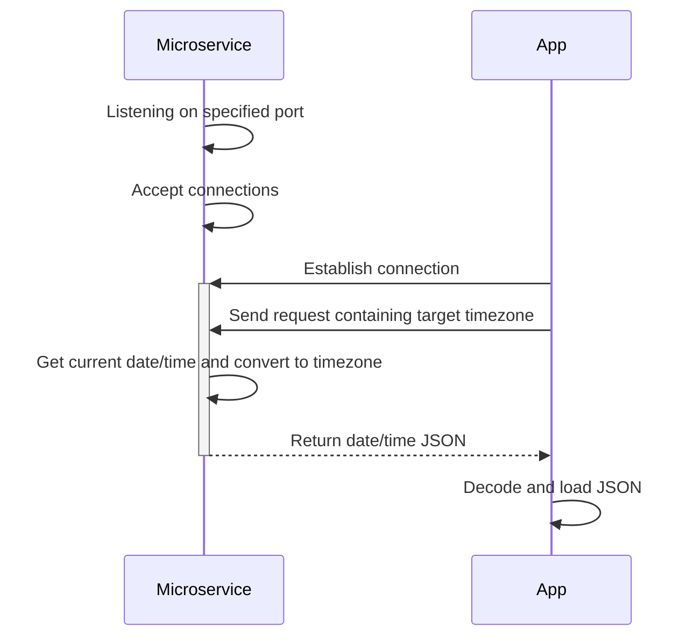

# TimeTeller
 Simple API that returns current date and time in JSON format over Sockets

## How to Request Data
This microservice communicates using sockets. If you are running it locally, you must ensure 
the <strong>host</strong> is set to <strong>127.0.0.1</strong>, and the <strong>port</strong> can be set to any 
port you like.
<br>
<br>
You're client must first connect to the server. Then you are able to send a request.
The request must conform to the following:
<ul>
  <li>Sent data must be utf-8 encoded.</li>
  <li>Data can be any value in the range (-24, 24), exclusive. This value is the offset from UTC for the timezone you're requesting.</li>
  <li>Optionally, data can be any timezone shortcode (e.g. "PST" for Pacific Standard Time).</li>
</ul>
<br>
This repository contains an example test_client.py you can view. <br>Here is the basic code needed if your client is 
written in <strong>Python</strong> and using the <strong>Socket</strong> module:

```
 import socket
 import json

 HOST = "127.0.0.1"
 PORT = [same port as microservice]
 DATA = [any value in range (-24,24), exclusive, or any timezone shortcode, such as "PST"]
  
  with socket.socket(socket.AF_INET, socket.SOCK_STREAM) as s:
      s.connect((HOST, PORT))             # connect to socket server
      s.sendall(DATA.encode("utf-8"))     # send data
```

## How to Receive Data
After sending a request to the service using the previous code snippet, the following code would be used 
to receive the response data:

```
      data = s.recv(1024)     # receive response
      response = json.loads(data.decode("utf-8"))   # decode and load JSON
```
<br>
The response sent by the microservice is built into a Python dictionary and sent as utf-8 encoded JSON.
An example response demonstrating the JSON structure is:

```
{
 "year": 2024,
 "month": 3,
 "day": 12,
 "hour": 15,
 "minute": 33,
 "second": 53,
 "UTC_offset": 6
}
```

## UML Diagram

